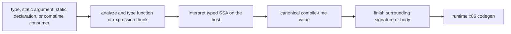

# Compile-time execution plan

This document proposes the execution architecture for roadmap milestone 1. The
language rules remain owned by [syntax&semantics.txt](syntax&semantics.txt); the
semantic choices listed here must be recorded there before their implementation
slice begins.

## Decision

Execute compile-time code with a portable interpreter over the published typed
SSA in `FunctionBodyAnalysis`.

- Execution runs in the compiler process on the host, after a demanded body or
  expression has been typed and before its consumer can finish typing.
- Do not execute emitted target x86 code.
- Do not add a second bytecode IR. The current dense value namespace, flat
  operand tables, block instruction ranges, and explicit terminators already
  form a register-machine execution representation.
- Do not JIT compile-time code. Native execution improves long-running steady
  state at the cost of compilation, linking, executable-memory management,
  compiler callbacks, target dependence, and failure isolation. Those costs are
  on the latency path for the small evaluations expected to dominate.
- Do not revive the legacy AST evaluator. Compile-time and runtime code must use
  the same name resolution, typing, coercion, control-flow, call, and ownership
  decisions.

This is one execution engine, not an interpreter/JIT tiering design. Reconsider
that decision only from profiles of representative programs after the
interpreter and incremental reuse are complete.

## Placement in compilation

Compile-time execution is demand driven, not a global phase:

The consumer can be `ResolveStatic`, `FunctionInstanceSignature`, static-call
specialization, or analysis of a `comptime` expression. An ordinary declared
function uses its existing instance body. A standalone static initializer,
static argument, type expression, or `comptime` body is analyzed as a synthetic
zero-runtime-parameter expression body, called a **comptime thunk**. A thunk has
an inferred result type and otherwise crosses the same typed publication
boundary as a function.

A thunk may see module statics, functions, and the enclosing function's static
parameters. It must not capture runtime parameters or outer runtime locals. Its
own block-local `const` and `var` bindings are ordinary typed locals. This keeps
the thunk query key complete without serializing an arbitrary runtime lexical
environment.

The result is embedded into the surrounding typed body as a constant, used as a
canonical `TypeId`, or interned into a specialization tuple. A `type` value never
reaches runtime codegen.

## Required representations

The first complete evaluator needs these independent value shapes:

1. scalar payloads: `int`, `bool`, `unit`, and `none`;
2. compiler type values containing a canonical `TypeId`;
3. callable values containing a concrete `InstanceId` and callable type;
4. struct values containing declaration-ordered fields;
5. variant values containing the active member type and payload;
6. success or failure as execution control flow, not as a value kind;
7. compiler-control outcomes, initially `exit(i32)`, separate from returns and
   fallible failure.

Keep the value's exposed `TypeId` separate from its payload representation. For
example, an integer widened to `int | none` has the variant as its exposed type
and an integer payload. This preserves the existing static-annotation contract
and avoids a one-variant union or repeated semantic type fields.

Introduce a session interner for immutable canonical compile-time values.
Specialization tuples and query results carry `CompileTimeValueId`, keeping
query keys small and making equal arguments cheap to compare. Aggregate
payloads recursively contain value IDs. During interpretation, however, scalar
temporaries stay in fixed-size frame slots and are interned only when they cross
a query boundary, become an aggregate member, or escape as a result. Arithmetic
must not allocate or hash on every instruction.

Add the primitive `TypeId.type`. It has no runtime layout. Signatures reject it
in runtime parameter positions; it is valid for static parameters and
compile-time function results. Add typed constants and the small set of
compiler-only type construction operations actually required by the milestone.
Runtime codegen never accepts those instructions in a reachable runtime body.

The typed body also needs a compact source map for instructions, terminators,
and call sites. This is execution metadata, not another IR, and is necessary for
reached execution errors and compile-time call traces.

## Queries and reuse

Add these conceptual queries; names can follow surrounding conventions when
implemented:

- `AnalyzeComptimeThunk(ComptimeSite) -> ?FunctionBodyAnalysis` types one source
  expression or block. `ComptimeSite` contains the owning item or instance and
  AST node identity.
- `ExecuteComptimeCall(CallKey) -> ?CompileTimeOutcome` executes a concrete
  function instance with an interned tuple of interpreted arguments. These are
  ordinary parameters supplied during interpretation, not static parameters in
  the instance's specialization identity.
- `ExecuteComptimeThunk(ThunkKey) -> ?CompileTimeOutcome` executes a typed
  thunk. Its key includes the site and enclosing specialization.

`CompileTimeOutcome` distinguishes successful value return, fallible failure,
and compiler-control effects such as `exit`. A consumer that requires a value
diagnoses an unhandled failure; compiler control propagates to the driver.
Source rejection remains `null` plus diagnostics; unavailable or stale state
remains distinct; compiler invariant failures remain assertions.

An interpreted direct or indirect call requests `ExecuteComptimeCall` for the
callee. This gives:

- memoization of repeated pure calls, including recursive calls with repeated
  arguments;
- sharing between call sites and workers;
- precise dependencies on callee bodies and referenced static values;
- ordinary query-cycle detection for recursion with an identical call key;
- equal-result retention across source revisions.

Changing an unrelated runtime body must not re-execute a cached comptime call.
Changing a callee body should invalidate only executions that depended on it.
Top-level statics should use this path instead of retaining a second “simple
static initializer” evaluator.

A recursive call that repeats the same concrete instance and interpreted
arguments is an exact cycle in the deterministic execution model and is a source
error. Recursion with changing arguments and loops otherwise run until they
finish or the compiler process is interrupted. Compile-time execution has no
language-defined call-depth, fuel, storage, or wall-clock limit. Interruption and
machine resource exhaustion are operational failures, not source diagnostics,
and must not be cached as evaluation results. The CLI relies on normal process
interruption such as Ctrl-C; this milestone adds no cancellation protocol or
configurable budget.

## Interpreter

Each frame allocates one slot array sized by `body.valueCount()` and initializes
the entry block arguments from the call key. Execution then repeats:

1. parallel-copy incoming branch arguments into the target block arguments;
2. execute the block's contiguous instruction range in source order;
3. execute its terminator and select the next block, return, fail, or propagate
   compiler control.

Dispatch directly on type-specific instructions such as `addi`; never rediscover
types or coercion legality. Struct and variant instructions operate on immutable
aggregate values. Calls use the evaluation query boundary. Compiler-materialized
copy, move, and drop hooks remain ordinary calls, so compile-time ownership
behavior cannot drift from runtime behavior.

The interpreter implements language arithmetic explicitly: signed 32-bit
addition, subtraction, multiplication, and negation wrap modulo 2^32 regardless
of the host. Operations with source-defined failure behavior produce source
diagnostics rather than host traps. Compiler-only services must be explicit
typed instructions or ordinary compiler-seeded declarations; they must not be
arbitrary host function calls.

Foreign calls, I/O, clocks, randomness, environment access, and target machine
addresses are unavailable during compile-time execution unless later exposed as
explicit compiler services. Diagnose such an instruction only when execution
reaches it, allowing one typed function to have distinct runtime and
compile-time paths without giving compile-time code ambient effects.

`exit` is available as an explicit compiler-control effect. The interpreter
returns a structured `exit(i32)` outcome instead of terminating the compiler
process itself. That outcome bypasses ordinary and fallible returns, propagates
through evaluation queries, stops the active compilation request without an
artifact, and is handled by the embedding driver. It is deterministic and may
be cached like a returned value. The CLI translates it to its own process exit
status using the host's normal status convention.

## Type-valued functions

Implement type-valued results on top of the evaluator rather than as a special
type resolver:

- A function explicitly returning `type` is evaluated when called from a type
  position or another compile-time context.
- Type positions accept a direct compile-time call and require its result to be
  a `type` value. This is evaluation, not return-type inference.
- Returned primitive, variant, callable, alias, and nominal type values are
  canonical `TypeId` values and therefore participate directly in static
  argument and instance identity.
- Calling a type-returning function from runtime code is a source error.

Anonymous nominal structs produced by a type-valued function have an identity
separate from their field shape. The identity combines an owner-relative source
site with the enclosing static specialization; ordinary interpreted arguments
do not participate. The field-definition query may resolve module statics and
static parameters but rejects function-local captures. This preserves nominal
identity, keeps the query key complete, and lets unrelated declaration
relocation retain the canonical type.

## Implementation slices

Each slice includes diagnostics and incremental tests before the next begins.

1. **Semantics and identity**
   - Status: implemented.
   - Specify visibility, purity, evaluation order, fallible outcomes, recursion,
     exact cycles, and type-position calls.
   - Add `type`, canonical value IDs, value tuples, and source-site keys.
   - Replace specialization tuples of copied value payloads with value IDs.

2. **Typed thunks and scalar interpreter**
   - Status: implemented, including instruction and terminator source maps.
   - Generalize body typing to publish an inferred-result comptime thunk.
   - Add source maps and interpret constants, integer operations, predicates,
     blocks, joins, loops, returns, and fallible control flow.
   - Route arbitrary static initializers and `comptime` expressions through it.

3. **Calls and specialization**
   - Status: implemented.
   - Interpret direct calls, concrete callable values, and indirect calls.
   - Route every static argument expression through thunk execution.
   - Add call memoization, exact cycle diagnostics, and call traces.
   - The call key has no budget dimension, and execution has no fixed depth,
     block, or aggregate rejection path.

4. **Aggregates and ownership**
   - Status: implemented.
   - Add struct and variant values, field operations, coercions, mutable call
     plumbing, and custom ownership hooks.
   - Verify left-to-right evaluation and path-specific cleanup behavior against
     runtime execution.

5. **Type-valued functions**
   - Status: implemented, including generated nominal structs with ownership
     declarations and specialization-aware custom hooks.
   - Add `type` constants/results and calls in type positions.
   - Add canonical type operations required by real generic examples.

6. **Cutover and cleanup**
   - Status: implemented for the current language surface.
   - Remove the simple static initializer evaluator and unsupported paths it
     replaces.
   - Keep one value representation, one call-key construction path, and one
     diagnostic owner for execution failures.

## Performance gates

`comptime_benchmark.zig` records the following workloads before optimizing the
interpreter:

- cold constant and short-expression evaluation;
- a tight arithmetic loop;
- recursive calls with and without repeated arguments;
- repeated calls across sites to measure query memoization;
- aggregate construction and field access;
- type-valued specialization with repeated and distinct arguments;
- no-op rebuild, unrelated edit, callee-body edit, and static-argument edit.

Record separately the time for thunk analysis, interpretation, result
publication, and query validation. The intended hot path has one instruction dispatch per SSA
instruction, no scalar heap allocation, one pre-sized slot array per frame, and
no target layout or machine-code work.

Use profiles to determine whether query scheduling, value interning, source maps,
or interpretation dominate representative builds. Optimize the measured
component while preserving the single typed-SSA execution path. Do not add a JIT
as an unmeasured escape hatch.

## Rejected alternatives

| Alternative | Why it is not the implementation path |
| --- | --- |
| Execute target x86 | Couples semantics to the target, blocks cross-target compilation, exposes the compiler to generated-code faults, and cannot cheaply manipulate session-local compiler identities. |
| Host-native JIT | Adds code generation and linking latency, W^X memory, an ABI bridge, callbacks, and crash containment before an evaluation can start. |
| Separate bytecode | Duplicates the existing register-shaped typed CFG and adds lowering, storage, invalidation, and diagnostic mapping without a required transformation. |
| AST interpreter | Repeats name resolution and typing decisions, performs expensive tree/environment walks, and risks compile-time/runtime semantic drift. |
| External sandbox process or Wasm | Improves isolation but adds serialization and IPC/runtime overhead and makes compiler-query callbacks expensive; no current unsafe comptime capability requires it. |
