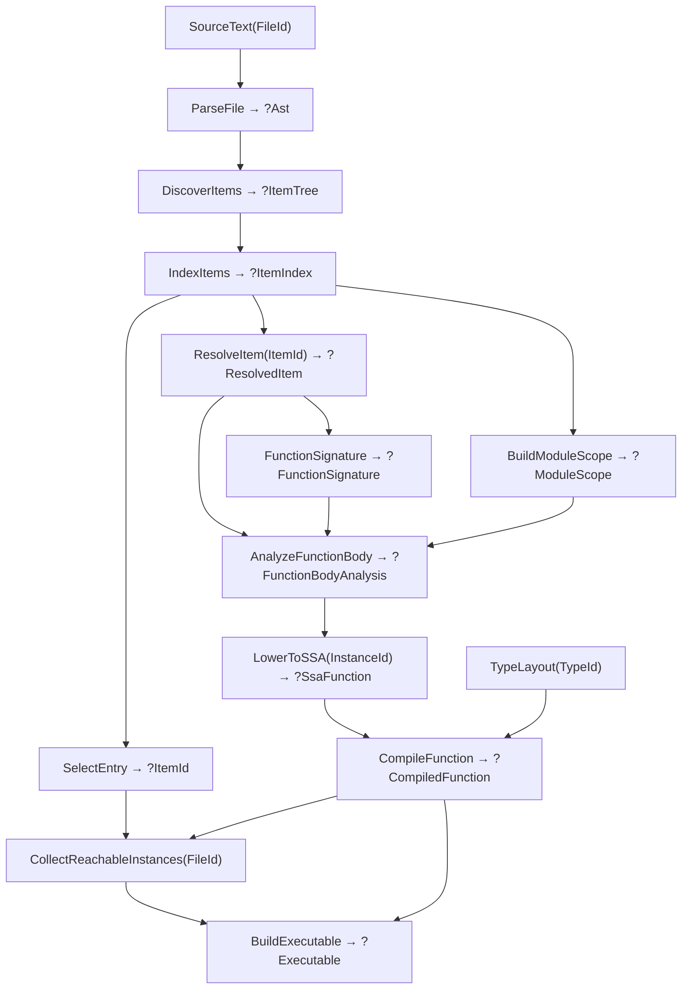

# Program flow

The current compiler is demand-driven. `main.zig` inserts owned source into a query database and requests `BuildExecutable`. Query definitions live in `query_structures.zig`; the concurrent engine lives in `query_new.zig`.

## Compilation

Arrows show data dependencies; requests travel toward their inputs. The diagram omits repeated source and AST reads.

1. Parsing owns token/node arrays. Discovery identifies top-level functions and adds a synthetic `$entry`. Duplicate function names reject discovery for the whole file, even without a call.
2. Indexing interns stable item locations. Resolution maps an `ItemId` to its current declaration. Module scope is an owned, name-sorted function table; building it does not analyze signatures or bodies.
3. `semantic.zig` resolves type syntax and lexical values into query-local `UnresolvedBody` scratch. `typing.zig` demands callable scope and called signatures as needed, validates types, and publishes owned typed IR. Declared bodies also depend on their own signature; the synthetic entry supplies its unit signature directly.
4. `ssa.zig` converts symbolic call targets from `ItemId` to `InstanceId`. `codegen_new.zig` uses interned variant data and layout queries to emit relocatable function artifacts, without compiling callees.
5. Reachability compiles each referenced instance once in breadth-first order, including recursive graphs. The linker consumes that order, lays out artifacts, and patches relocations. Unreachable function bodies stay unanalyzed.
6. The CLI renders transitive diagnostics or optional AST/SSA/assembly/timing views, writes the executable through `runtime.zig`, and runs it. SSA debug output uses the same reachable set. The single-file CLI currently uses one worker.

## Revisions and failures

`ctx.input` and `ctx.get` record dependencies; `ctx.emit` records diagnostics. Requests share queued/running work, use work stealing while waiting, and detect cycles.

An idle input update advances the revision only when its value changes. A cached query re-verifies recorded dependencies and reruns only if they changed. Equal output and accumulators preserve the previous allocation and `changed_at`; changed output or diagnostics become observable. Fresh dependency sets replace old edges on commit. An infrastructure failure discards fresh state, keeps the last completed memo, and remains retryable.

Per-function queries do **not** yet mean per-body source invalidation: signature and body queries read whole-file source and AST. A same-file edit can rerun several analyses; equal results stop changes propagating farther. Callee body edits can therefore retain caller SSA and code, while executable construction still observes the changed callee. Reachability edits remove obsolete dependencies.

Most compiler queries return `?Output`: `null` propagates source rejection or unavailable/stale items. It does not by itself imply a new diagnostic. Missing inputs and infrastructure failures use errors; impossible state uses assertions. See [ARCHITECTURE.md](ARCHITECTURE.md) for the contracts.

## Lifetimes

| Data | Owner and validity |
| --- | --- |
| Source bytes | Database input; replaced by `setInput` |
| Item names and canonical variant members | Database interners; valid for the session |
| AST, indexes, scopes, signatures, IR, artifacts, reachability, executable bytes | Cached outputs; valid until replacement or database destruction |
| Unresolved body, borrowed source spellings, typing and traversal scratch | One query run; freed before publication |
| Dependency edges and diagnostics | Entry-owned; committed or discarded with recomputation |
| `./prog` | File copy of executable bytes; independent of database lifetime |

Equal recomputation retains result pointers. Changed recomputation may invalidate them; consumers needing longer lifetimes must copy or retain stable identities.
