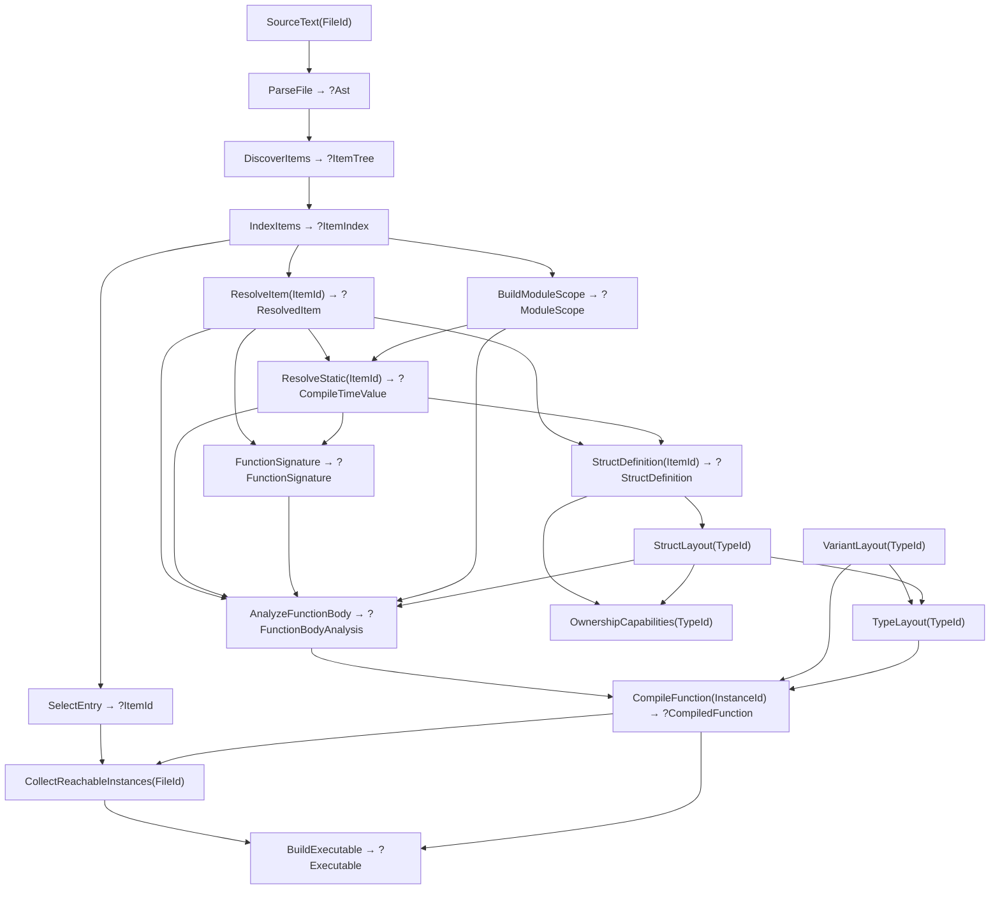

# Program flow

The current compiler is demand-driven. `main.zig` inserts owned source into a query database and requests `BuildExecutable`. Query definitions live in `query_structures.zig`; the concurrent engine lives in `query_new.zig`.

## Compilation

Arrows show data dependencies; requests travel toward their inputs. The diagram omits repeated source and AST reads.

1. Parsing owns token/node arrays. Discovery identifies top-level function and static declarations and adds a synthetic `$entry`. Duplicate top-level names reject discovery for the whole file, even when no consumer demands either declaration.
2. Indexing interns stable item locations. Resolution maps an `ItemId` to its current declaration. Module scope is an owned, name-sorted declaration table with kind-filtered function and static lookup; building it does not analyze signatures, bodies, or initializers. `ResolveStatic` evaluates a demanded simple value, type alias, nominal struct identity, or symbolic function alias, recursively demanding referenced declarations. `StructDefinition` separately owns declaration-order field names, resolved types, and source spans. `OwnershipCapabilities` computes move/copy/drop facts from type structure after validating struct layout. Static query cycles become source diagnostics at the closing reference.
3. `semantic.zig` validates source forms and resolves immutable values and stable mutable-local identities into a query-local graph of expressions, conditions, blocks, returns, and loop control. `typing.zig` demands callable scope, referenced signatures, and nominal struct definitions as needed, validates types and return completeness, and builds the sole owned SSA control-flow graph. Blocks preserve evaluation order and lexical scope; typing snapshots mutable-local values at control-flow edges and carries changed values through joins, loop backedges, and exits as block arguments. Accepted variant coercions carry typing-selected destination tags in a body-owned flat mapping table. Struct initializers retain source-ordered operands with resolved declaration field indices; field accesses retain their resolved index and type. Variant membership lowers to tag reads and ordinary integer predicate branches, while a fallible `as` materializes its narrowed value only in the success block. Static runtime values materialize as ordinary constants; function references retain `ItemId` until codegen. Calls evaluate the callee and then each argument exactly once from left to right. Calls to declarations remain direct, while calls through parameters, bindings, returns, and static aliases become indirect. Previously resolved immutable values are reused. Declared bodies also depend on their own signature; the synthetic entry supplies its unit signature directly.
4. `codegen_new.zig` consumes the typed graph directly, wrapping call and function-reference targets in `InstanceId` when emitting symbolic references. It reads common layouts, variant payload offsets, and struct field offsets from their owning queries, without compiling callees. Struct construction writes fields at declaration offsets in source evaluation order; field access copies the selected field range. Struct layout rejects recursive by-value containment before publishing offsets. Variant injection and widening copy payloads and apply typing's supplied destination tag mappings; extraction copies the selected payload into its narrowed representation. Function references materialize as relocated code addresses; indirect calls use the same stack argument and return convention as direct calls.
5. Reachability compiles each referenced instance once in breadth-first order, including recursive graphs. The linker consumes that order, lays out artifacts, and patches relocations. Unreachable function bodies stay unanalyzed.
6. The CLI renders transitive diagnostics or optional AST/SSA/assembly/timing views, writes the executable through `runtime.zig`, and runs it. SSA debug output uses the same reachable set. The single-file CLI currently uses one worker.

## Revisions and failures

`ctx.input` and `ctx.get` record dependencies; `ctx.emit` records diagnostics. Requests share queued/running work. Idle workers steal general work; a worker waiting recursively runs only the queued dependency it awaits, which prevents unrelated work from acquiring a dependency on the waiting query. Cycle detection includes the dependency currently being revalidated, without treating other stale edges as current dependencies.

An idle input update advances the revision only when its value changes. A cached query re-verifies recorded dependencies and reruns only if they changed. Equal output and accumulators preserve the previous allocation and `changed_at`; changed output or diagnostics become observable. Fresh dependency sets replace old edges on commit. An infrastructure failure discards fresh state, keeps the last completed memo, and remains retryable.

Per-function queries do **not** yet mean per-body source invalidation: signature and body queries read whole-file source and AST. A same-file edit can rerun several analyses; equal results stop changes propagating farther. Callee body edits can therefore retain caller SSA and code, while executable construction still observes the changed callee. Reachability edits remove obsolete dependencies.

Most compiler queries return `?Output`: `null` propagates source rejection or unavailable/stale items. It does not by itself imply a new diagnostic. Missing inputs and infrastructure failures use errors; impossible state uses assertions. See [ARCHITECTURE.md](ARCHITECTURE.md) for the contracts.

## Lifetimes

| Data | Owner and validity |
| --- | --- |
| Source bytes | Database input; replaced by `setInput` |
| Item names, canonical variants, and callable signatures | Database interners; valid for the session |
| AST, indexes, scopes, signatures, IR, artifacts, reachability, executable bytes | Cached outputs; valid until replacement or database destruction |
| Expression graph, borrowed source spellings, typing and traversal scratch | One query run; freed before publication |
| Dependency edges and diagnostics | Entry-owned; committed or discarded with recomputation |
| `./prog` | File copy of executable bytes; independent of database lifetime |

Equal recomputation retains result pointers. Changed recomputation may invalidate them; consumers needing longer lifetimes must copy or retain stable identities.
