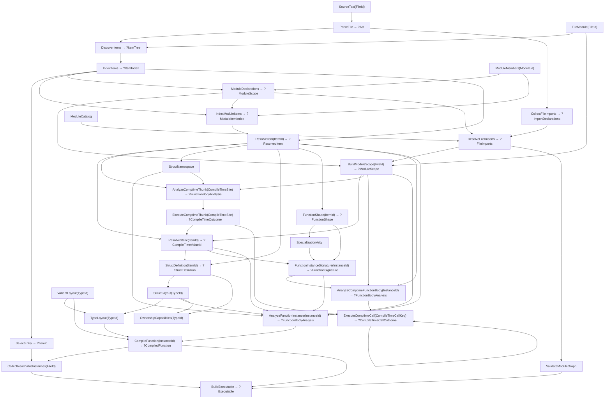

# Program flow

The current compiler is demand-driven. `src/main.zig` inserts owned source into a query database and requests `BuildExecutable`. Query definitions live in `src/query_structures.zig`; the concurrent engine lives in `src/query_new.zig`.

## Compilation

Arrows show data dependencies; requests travel toward their inputs. The diagram omits repeated source and AST reads.

1. Parsing owns token/node arrays. Discovery identifies top-level function and static declarations, ordinary struct namespace declarations, owner-qualified function-valued struct properties, generated-struct member sites, and a synthetic `$entry`. Child namespace and hook items are excluded from module scope and use ordinary signature/body queries. Struct-definition analysis validates each hook against its exact operation-specific callable type and retains its concrete `InstanceId`; generated hooks inherit the enclosing factory specialization. Duplicate top-level names reject discovery for the whole file, even when no consumer demands either declaration.
2. File indexing interns stable item identities. `ModuleDeclarations` validates names across current member files; `IndexModuleItems` publishes their replaceable source locations. Resolution maps an `ItemId` through that module index (or the designated file index for a synthetic entry). Effective file scope is an owned, name-sorted table combining module declarations with that file's imported declarations; it supports kind-filtered function and static lookup; building it does not analyze signatures, bodies, or initializers. `ResolveStatic` and `ResolveStaticInstance` publish a demanded value's canonical `CompileTimeValueId`, recursively demanding referenced declarations. Explicit `: type` aliases and declared nominal struct identities resolve directly. Generated nominal identities combine an owner-relative anonymous-struct site with the enclosing static specialization, and `GeneratedStructDefinition` resolves fields and ownership declarations when a consumer needs structure. Every inferred or runtime-annotated initializer is published as inferred-result typed SSA by `AnalyzeComptimeThunk` and evaluated by `ExecuteComptimeThunk`, including literals and symbolic aliases; explicit `comptime` expressions, static arguments, and direct calls in type positions use the same site-keyed path and may see the enclosing static specialization but not runtime locals. Direct and concrete indirect calls demand `ExecuteComptimeCall`, whose key combines the specialized instance with an interned tuple of interpreted arguments. It types the callee through `AnalyzeComptimeFunctionBody`, memoizes equal calls across sites, and diagnoses recursion that repeats the same instance-and-argument pair. Changing-argument recursion and loops run until completion or process interruption. Scalar, aggregate, and canonical type results are interned at this query boundary; mutable calls also publish their final canonical argument tuple for typed copy-back, while failure and `exit` remain control outcomes. The execution-diagnostic boundary maps failures to instruction or terminator spans and unwinds call-site notes. `StructDefinition` and `GeneratedStructDefinition` own the common declaration-order field shape and ownership overrides. `OwnershipCapabilities` computes move/copy/drop facts from type structure after validating struct layout and explicit strategies against direct fields. Static query cycles become source diagnostics at the closing reference.
3. `semantic.zig` validates source forms and resolves lexical bindings to stable place identities in a query-local graph of expressions, conditions, blocks, returns, and loop control. Lexical declarations are checked against active locals and module-visible names without evaluating those declarations. A direct generic call evaluates each value static position as a typed comptime thunk, interns the canonical argument tuple, and leaves only runtime operands in the graph. Instance signature and body analysis resolve static names before module statics, so runtime parameter and return types may depend on static type parameters; scalar and aggregate static values materialize as ordinary expressions when used in the body. Unbound generic function values remain rejected. Owned `var` and `deinit` parameters receive mutable local-place identities; `imm` parameters remain borrowed entry values. `typing.zig` demands instantiated signatures, nominal struct definitions, and ownership capabilities as needed, validates types and return completeness, and builds the sole owned SSA control-flow graph. Blocks preserve evaluation order and lexical scope; typing snapshots place availability and mutable-local values at control-flow edges. Joins conservatively merge ownership state, while only changed mutable values become block arguments. Bare place provenance distinguishes borrowing uses from owning destinations; conditional and loop results carry a boolean block argument when an effectful copy is required on only some incoming paths. Explicit root transfer invalidates a place, and whole assignment restores a mutable root. Lexical exits update source availability but do not schedule destruction. After CFG construction, `lifetime.zig` computes path-sensitive generation endings and typing materializes type-specific cleanup at the earliest completed boundary after each final use; explicit-drop trees require transfer or reach a `deinit`-authorized parameter on every path. Custom ownership hooks lower to ordinary direct calls at owning and lifetime-ending uses. Fieldwise operations recurse through struct fields or branch over a variant tag only when nested hooks require runtime work. While a hook body is active, its compiler-generated argument, result, and lifetime operations use primitive ownership rather than redispatching to that same hook. Accepted variant coercions carry typing-selected destination tags in a body-owned flat mapping table. Struct initializers retain source-ordered operands with resolved declaration field indices; field accesses retain their resolved index and type. Assignments through mutable-local field paths read compound targets before the right-hand side, then rebuild enclosing structs from the latest root value and replace its SSA value. Variant membership lowers to tag reads and ordinary integer predicate branches, while a fallible `as` materializes its narrowed value only in the success block. Calls evaluate runtime arguments exactly once from left to right. `imm` arguments borrow; `var` and `deinit` arguments own a copied bare place, an explicit root transfer, or a temporary. Calls to declarations remain direct, while calls through parameters, bindings, returns, and static aliases become indirect. Declared bodies also depend on their own instantiated signature; the synthetic entry supplies its unit signature directly.
4. `codegen_new.zig` consumes the typed graph directly. Direct calls retain their declaration plus optional specialization identity and publish that concrete `InstanceId` as a symbolic reference; function references retain their enclosing specialization, or the default instance when none is captured. Codegen reads common layouts, variant payload offsets, and struct field offsets from their owning queries without compiling callees. Struct construction writes fields at declaration offsets in source evaluation order; field access copies the selected field range; field update copies the aggregate and overwrites one resolved field range. Struct layout rejects recursive by-value containment before publishing offsets. Variant injection and widening copy payloads and apply typing's supplied destination tag mappings; extraction copies the selected payload into its narrowed representation. Function references materialize as relocated code addresses; indirect calls use the same stack argument and return convention as direct calls.
5. `ValidateModuleGraph` first validates imports and public exports throughout the dependency graph without compiling or evaluating any entry body. Reachability starts only at the designated entry and compiles each referenced instance once in breadth-first order, including recursive graphs. The linker consumes that order, lays out artifacts, and patches relocations. Unreachable function bodies stay unanalyzed.
6. The CLI handles a transitive compile-time `exit` control outcome without producing an executable, otherwise renders transitive diagnostics or optional AST/SSA/assembly/timing views, writes the executable through `src/runtime.zig`, and runs it. SSA debug output uses the same reachable set. The CLI registers the entry directory tree plus the embedded `std` sources and currently uses one worker.

Mutable calls add two typed plumbing operations to stages 3 and 4. A callee writes each final borrowed parameter value to its incoming argument slot before returning. The caller reloads those slots on both ordinary and fallible continuations, then rebuilds each resolved root-plus-field path before later cleanup or calls can reuse the outgoing area.

Import resolution is available as a separate query boundary. It uses the explicit
module catalog for existence, including failed-lookup invalidation, and collected
owned syntax for file bindings and canonical re-exports. Semantic name resolution
uses the defining file's effective scope in runtime bodies and compile-time
queries. Module namespaces remain compile-time lookup results; struct namespaces
retain enclosing static arguments, and value fields enter the existing typed IR.
`ResolvePreludeImports` resolves the compiler-owned prelude once from a dedicated
standard-library input, independently of the user module catalog. User-file
resolution adds its public exports as non-reexported default bindings. Standard
library files receive no defaults. An explicit user import of exactly that
module suppresses the defaults and is then resolved normally, so an empty
selection is the opt-out form. This happens over module/query data, never by
rewriting source.
The CLI labels loaded ASTs and reachable SSA/assembly functions with their source
paths. Timing follows normal demand and never analyzes unused bodies.

## Revisions and failures

`ctx.input` and `ctx.get` record dependencies; `ctx.emit` records diagnostics. Requests share queued/running work. Idle workers steal general work; a worker waiting recursively runs only the queued dependency it awaits, which prevents unrelated work from acquiring a dependency on the waiting query. Cycle detection includes the dependency currently being revalidated, without treating other stale edges as current dependencies.

`SourceRegistry.update` refreshes a directory snapshot in an idle database. It preserves file IDs across enumeration changes, updates source ownership and membership, and records module additions/removals in the catalog. Removed source inputs remain unreachable through current membership.

An idle input update advances the revision only when its value changes. A cached query re-verifies recorded dependencies and reruns only if they changed. Equal output and accumulators preserve the previous allocation and `changed_at`; changed output or diagnostics become observable. Fresh dependency sets replace old edges on commit. An infrastructure failure discards fresh state, keeps the last completed memo, and remains retryable.

Per-function queries do **not** yet mean per-body source invalidation: signature and body queries read whole-file source and AST. A same-file edit can rerun several analyses; equal results stop changes propagating farther. Callee body edits can therefore retain caller SSA and code, while executable construction still observes the changed callee. Reachability edits remove obsolete dependencies.

Most compiler queries return `?Output`: `null` propagates source rejection or unavailable/stale items. It does not by itself imply a new diagnostic. Missing inputs and infrastructure failures use errors; impossible state uses assertions. See [ARCHITECTURE.md](ARCHITECTURE.md) for the contracts.

## Lifetimes

| Data | Owner and validity |
| --- | --- |
| Source bytes | Database input; replaced by `setInput` |
| Item names, canonical variants, callable signatures, compile-time values, and value tuples | Database interners; valid for the session |
| AST, indexes, scopes, signatures, IR, artifacts, reachability, executable bytes | Cached outputs; valid until replacement or database destruction |
| Expression graph, borrowed source spellings, typing and traversal scratch | One query run; freed before publication |
| Dependency edges and diagnostics | Entry-owned; committed or discarded with recomputation |
| `./prog` | File copy of executable bytes; independent of database lifetime |

Equal recomputation retains result pointers. Changed recomputation may invalidate them; consumers needing longer lifetimes must copy or retain stable identities.
