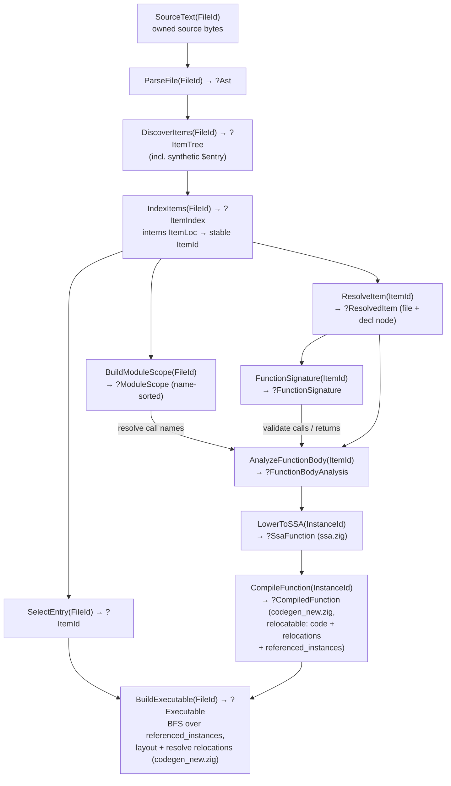
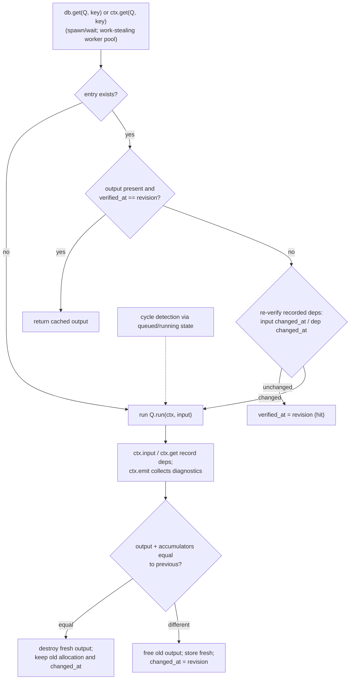

# Program Flow

How the incremental compiler pipeline executes. Design rules live in `ARCHITECTURE.md`; milestone status lives in `ROADMAP.md`.

The pipeline is a Salsa-style query system: every compilation step is a memoized query that pulls its inputs on demand, records what it read, and survives source edits by re-verifying dependencies instead of recomputing. Queries are defined in `query_structures.zig`, run on the concurrent engine in `query_new.zig`, and exchange the shared value types in `structures.zig`. `query_new_test.zig` drives the full path, ending in `runtime.writeProgram`/`runProg`.

## Query graph

- Per-function granularity: editing one body invalidates only `AnalyzeFunctionBody` for that item and downstream per-instance queries; equal signatures suppress callee-side recomputation.
- Semantic failures are values (`?Output` plus emitted diagnostics); errors are reserved for infrastructure failures.
- The executable's entry is each file's synthetic top-level `$entry`; a `main` declaration is ordinary.

## Engine execution cycle (`query_new.zig`)

Inputs (`addInput`/`setInput`) may change only while the database is idle; a real value change bumps the global revision. Every result type defines structural equality — equality gates replacement, so unchanged results keep their allocation and pointer identity across revisions.

## Data structures and lifetimes

Ownership follows one rule: **cached values own their allocations; identities are small stable keys.** Everything below lives until `Database.deinit` unless noted.

| Lifetime | Structure | Notes |
| --- | --- | --- |
| Session (owned by DB inputs) | `SourceText` value `[]const u8` | Cloned into `Database`; freed and replaced only by `setInput` |
| Session (interner) | `ItemId` → interned `ItemLoc` | Opaque `enum(u32)`; names owned by the interner; stable across edits, reused after remove/restore |
| Session (memoized outputs) | `Ast` | Flat `[]Token`, `[]Node`, `[]Node.Index`; owns its arrays, stores `FileId` instead of borrowing text |
| " | `ItemTree`, `ItemIndex`, `ModuleScope` | Owned slices/hash map of file items; scope maps names to `ItemId`s |
| " | `FunctionSignature` | Owned parameter-type slice |
| " | `FunctionBodyAnalysis` | `FunctionIr(ItemId)`: flat arrays of block args, call operands, typed instructions, blocks |
| " | `SsaFunction` | Same shape as above with symbolic `InstanceId` call targets |
| " | `CompiledFunction` | Relocatable machine code + relocation records + referenced-instance table; no addresses |
| " | `Executable` | Final linked bytes; consumer must copy before `Database.deinit` |
| Per-recompute metadata | `Entry.deps`, `Entry.input_deps` | Fresh dependency edge lists committed atomically or discarded |
| Query-transient (freed within one query run) | `UnresolvedBody` | Name-resolution scratch built by semantic.zig, consumed and freed before publishing `FunctionBodyAnalysis` |
| " | BFS sets, scratch lists | e.g. reachability set in `BuildExecutable` |
| Beyond the process | `Executable.bytes` | Copied into the `./prog` file by `runtime.writeProgram` |

Result pointers are stable across equal recomputations but must be treated as invalid once a changed recomputation replaces a memo.
