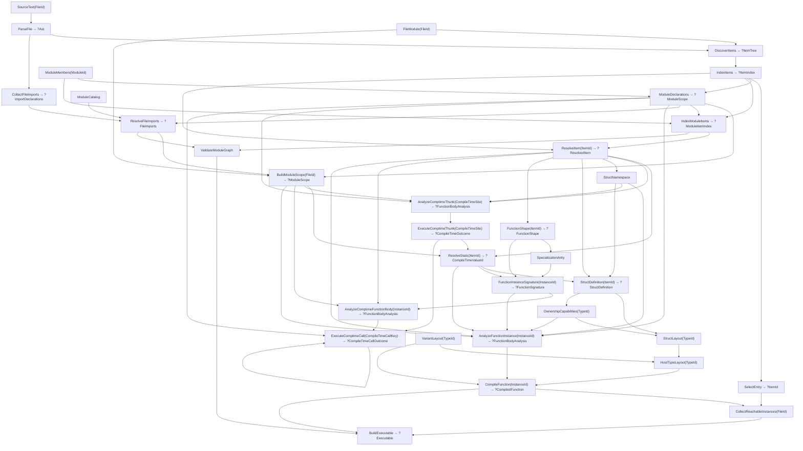

# Program flow

`src/main.zig` registers source inputs and requests `BuildExecutable`. This document follows query demand, recomputation, and result lifetimes; [ARCHITECTURE.md](ARCHITECTURE.md) owns stage boundaries and representations.

## Compilation

Arrows show data dependencies; requests travel toward their inputs. The diagram omits repeated source and AST reads.

1. `ParseFile` and `DiscoverItems` identify declarations and the synthetic entry. `IndexItems` interns identities; `ModuleDeclarations` checks names across current member files, and `IndexModuleItems` publishes source locations. Building effective file scope does not demand signatures or bodies. Duplicate declarations fail even when unused.
2. Static resolution demands referenced declarations recursively. Direct type aliases and declared struct identities can resolve without interpretation. Other initializers, explicit `comptime` expressions, static arguments, and calls in type positions use `AnalyzeComptimeThunk` then `ExecuteComptimeThunk`; the site key includes specialization and optional expected type. `ExecuteComptimeCall` keys concrete calls by instance and canonical arguments, obtaining typed bodies from `AnalyzeComptimeFunctionBody`. Mutable calls also return canonical copy-back arguments. Repeated instance-and-argument recursion is diagnosed; changing-argument recursion and loops have no step limit. Execution failures retain instruction spans and call-site notes.
3. `AnalyzeFunctionInstance` demands its signature, effective scope, definitions, and ownership capabilities, then builds typed SSA. After deferred reference uses resolve, lifetime analysis plans cleanup, typing diagnoses explicit abandonment, and cleanup is materialized. A final reference check accounts for mutating destructors at their actual lowered positions before the body is published. All runtime instances use this same query, including unspecialized declarations; the synthetic entry supplies its own unit signature.
4. `CompileFunction` demands the typed body and validates runtime eligibility, including initializer regions, before requesting host layouts; it does not compile callees. Layout consumes logical ownership validation. Codegen publishes machine code with symbolic instance references; emission and assembly rendering use the same instruction descriptions.
5. `ValidateModuleGraph` first validates imports, public exports, and converter declaration placement, ownership, and parameter shape throughout the dependency graph without compiling or evaluating any entry body. Reachability starts only at the designated entry and compiles each referenced instance once in breadth-first order, including recursive graphs. The linker consumes that order, lays out artifacts, and patches relocations. Unreachable function bodies stay unanalyzed.
6. The CLI handles a transitive compile-time `exit` control outcome without producing an executable, otherwise renders transitive diagnostics or optional AST/SSA/assembly/timing views, writes the executable through `src/runtime.zig`, and runs it through a private hard link to the published inode (or a private copy on filesystems without hard links). SSA debug output uses the same reachable set. The CLI registers the entry directory tree plus the embedded `std` sources and uses two workers by default where available. Module validation prefetches independent file queries, and reachability prefetches referenced function compilation.

Before a mutable call returns, the callee writes final borrowed parameter values to its incoming slots. Both ordinary and fallible caller continuations reload them and rebuild root-plus-field paths, or store them into in-place local storage, before another call or cleanup can reuse the outgoing area.

Known expected types discover conversions through the existing source/target
owner module declarations and specialize through normal function signatures.
Imports do not control the candidate set. Generic argument inference types full
expressions without executing conversions; executable arguments and their
selected conversions then evaluate left to right. For frame-local static-only
sources, interpretation supplies the current canonical value to candidate
discovery and the ordinary call executor. Selected constraints and converter
bodies therefore contribute normal query dependencies, including after local
mutation. Such staged operations cannot persist as runtime bodies; source and
converter edits invalidate their published results normally.

Import resolution is available as a separate query boundary. It uses the explicit
module catalog for existence, including failed-lookup invalidation, and collected
owned syntax for file bindings and canonical re-exports. Semantic name resolution
uses the defining file's effective scope in runtime bodies and compile-time
queries. Module namespaces remain compile-time lookup results; struct namespaces
retain enclosing static arguments, and value fields enter the existing typed IR.
`ResolvePreludeImports` resolves the compiler-owned prelude once from a dedicated
standard-library input, independently of the user module catalog. User-file
resolution adds its public exports as non-reexported default bindings. Standard
library files receive no defaults. An explicit user import of exactly that
module suppresses the defaults and is then resolved normally, so an empty
selection is the opt-out form. This happens over module/query data, never by
rewriting source.
The CLI labels loaded ASTs and reachable SSA/assembly functions with their source
paths. Timing follows normal demand and never analyzes unused bodies.
Timing rows are dependency-inclusive wall-clock intervals: `validate modules`
covers module-graph validation; `analyze entry` covers entry selection and entry
body analysis; `compile reachable functions (includes callee analysis)` covers
reachable compilation, including any callee typing it demands. These are not
exclusive per-stage totals, and compile-time work is charged to the interval
that first demands it.

## Revisions and failures

`ctx.input`, `ctx.get`, and `ctx.spawn` record dependencies; `ctx.emit` records diagnostics. Requests share queued/running work. Successful computations settle all spawned dependencies before publishing their output and transitive accumulators. A pending-work counter guards input updates without scanning the query cache. Idle workers steal general work; a worker waiting recursively runs only the queued dependency it awaits, which prevents unrelated work from acquiring a dependency on the waiting query. Cycle detection includes the dependency currently being revalidated, without treating other stale edges as current dependencies.

`SourceRegistry.update` refreshes a directory snapshot in an idle database. It preserves file IDs across enumeration changes, updates source ownership and membership, and records module additions/removals in the catalog. Removed source inputs remain unreachable through current membership.

Before building the query database, an ordinary CLI run looks for a successful
whole-program executable under a content key covering every source and module
input plus the linked compiler build ID, or a running binary digest when no
build ID is available. Cache files carry a payload checksum and are published
by atomic replace, so a partial or damaged file is never used and
parallel compiler processes can share the directory. A changed source misses
the executable cache and takes the normal query path. The CLI then loads a
query snapshot for the same file-path mapping:
interned identities are restored before source registration, then successful
runtime function bodies and compiled artifacts are restored after their recorded
input contents and equal-result query boundaries are checked. A stale result is
recomputed through the ordinary query path. Query snapshots are rewritten after
successful compilation; malformed snapshots are discarded and built afresh.

An idle input update advances the revision only when its value changes. A missing input read records a dependency before returning `InputNotFound`; registering that input later advances the revision and invalidates cached fallback results. A cached query re-verifies recorded dependencies and reruns if they changed or failed, allowing its `run` function to handle dependency errors again. Equal output and accumulators preserve the previous allocation and `changed_at`; changed output or diagnostics become observable. Fresh dependency sets replace old edges on commit. An infrastructure failure discards fresh state, keeps the last completed memo, and remains retryable. Failed children contribute no stale accumulators; their failure revision also invalidates parents' cached fallbacks after recovery to an otherwise equal result.

Per-function queries do **not** yet mean per-body source invalidation: signature and body queries read whole-file source and AST. A same-file edit can rerun several analyses; equal results stop changes propagating farther. Callee body edits can therefore retain caller SSA and code, while executable construction still observes the changed callee. Reachability edits remove obsolete dependencies.

Most compiler queries return `?Output`: `null` propagates source rejection or unavailable/stale items. It does not by itself imply a new diagnostic. Missing inputs and infrastructure failures use errors; impossible state uses assertions. See [ARCHITECTURE.md](ARCHITECTURE.md) for the contracts.

## Lifetimes

| Data | Owner and validity |
| --- | --- |
| Source bytes | Database input; replaced by `setInput` |
| Item names, canonical variants, callable signatures, compile-time values, and value tuples | Database interners; valid for the session |
| AST, indexes, scopes, signatures, IR, artifacts, reachability, executable bytes | Cached outputs; valid until replacement or database destruction |
| Expression graph, borrowed source spellings, typing and traversal scratch | One query run; freed before publication |
| Dependency edges and diagnostics | Entry-owned; committed or discarded with recomputation |
| `./prog` | Atomically published executable bytes; independent of database lifetime |

Equal recomputation retains result pointers. Changed recomputation may invalidate them; consumers needing longer lifetimes must copy or retain stable identities.
